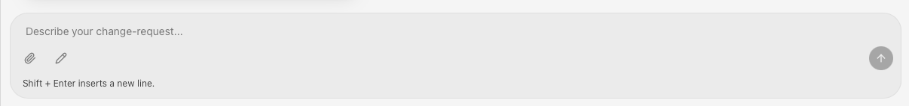

# PAGES – Bedienungsanleitung

## Kurzbeschreibung

PAGES (**P**rompt-based **A**I **G**eneration **E**ngine for **S**ites) ist ein No-Code-Werkzeug, mit dem Websites allein durch natürlichsprachige/multi-modale Beschreibung erstellt und verändert werden – ohne dass der Nutzer selbst Quellcode sieht oder schreibt.

Der Nutzer beschreibt in einem Chat, was er möchte. Im Hintergrund führt eine KI diese Anfrage gegen ein echtes Software-Projekt aus: Sie liest und schreibt Dateien, baut Seiten, Komponenten und Inhalte und macht das Ergebnis unmittelbar in einer Vorschau sichtbar. Für Inhalte, die man später häufiger selbst ändern möchte (z. B. Speisekarte, Öffnungszeiten, Fotos), richtet die KI zusätzlich ein Content-Management-System (CMS) ein, das der Nutzer danach direkt bedienen kann – ohne dafür jedes Mal wieder mit der KI zu chatten.

Kurz gesagt: **Layout, Struktur und Funktionen** einer Website werden per Chat mit der KI erstellt und angepasst; **redaktionelle Inhalte**, die sich oft ändern, werden direkt im CMS gepflegt.

Das System selbst arbeitet dabei strukturiert: Das System baut nicht nur wie klassische "Vibe-Coding" Werkzeuge (wie bspw. Lovable) Code der den Eingaben entspricht, sondern hilft dem Nutzer zudem strukturiert die richtige Lösung bauen zu können (genannt "agentische Softwareentwicklung").

---

## Begriffe

### Artefakt

Ein Artefakt ist eine einzelne Website (bzw. Webanwendung), die mit PAGES verwaltet wird. Jedes Artefakt ist ein eigenständiges Projekt mit:

- einem Namen (z. B. „SushiExpress“ - eine Webseite für ein Sushi-Restaurant) und einem eindeutigen technischen Namen,
- einem eigenen Quellcode-Stand, der bei der Erstellung aus einer Vorlage (Starter-Template) erzeugt wird,
- einer eigenen Liste von Änderungsanfragen.

Man legt zuerst ein Artefakt an und stellt darin anschließend Änderungsanfragen, um es Schritt für Schritt aufzubauen und zu pflegen.

### Änderungsanfrage

Eine Änderungsanfrage ist ein einzelner Chat-Thread innerhalb eines Artefakts. Jede Aufgabe, die man der KI stellt – vom ersten Erstellen der Website bis zur kleinsten Textänderung – läuft als eigene Änderungsanfrage ab. Eine Änderungsanfrage:

- bekommt automatisch einen passenden Titel von der KI,
- kann sich auf eine bestimmte Seite der Website beziehen (z. B. „/kontakt“),
- kann Links enthalten, die die KI selbst hinterlegt hat – etwa einen direkten Link ins CMS, falls die Anfrage damit zu tun hatte.

Um das optimale Ergebnis zu erhalten, erstellen Sie für jede Unterseite (z. B. "/kontakt") eine Änderungsanfrage.

### Intent

Intent bezeichnet die eigentliche **Absicht** hinter dem, was man der KI im Chat schreibt – unabhängig davon, wie technisch oder unvollständig die Formulierung ist. Die zentrale Aufgabe der KI ist es, diesen Intent zu erfassen (Rückfragen zu stellen, wo nötig) und ihn in konkrete Seiten, Inhalte und Funktionen zu übersetzen. Diese Arbeitsweise – Software anhand der erfassten Absicht statt anhand technischer Spezifikationen zu entwickeln – wird im Projekt „Intent-Driven Development“ genannt.

### Asset

Ein Asset ist eine Mediendatei, die auf der Website verwendet wird – zum Beispiel ein Foto, ein Logo oder eine Grafik. Assets können auf zwei Wegen in ein Artefakt gelangen:

- als Anhang direkt im Chat (z. B. ein Logo, das man der KI beim Erstellen der Website mitgibt),
- als Upload direkt im CMS (z. B. neue Speisenfotos, die man später selbst in der Galerie ergänzt).

### Directus bzw. CMS

[https://directus.com/](https://directus.com/) ist bei diesem Evaluationsverfahren das CMS (Content-Management-System), das PAGES für strukturierte, sich oft ändernde Inhalte einrichtet – z. B. Speisekarte, Öffnungszeiten, Kontaktdaten, Bildergalerie oder eingegangene Kontaktformular-Nachrichten. Die KI legt beim Erstellen der Website die passende Datenstruktur in Directus an (welche Felder es z. B. für ein Menü-Gericht gibt) und verbindet die Website damit.

Der entscheidende Punkt: **Ist die Struktur einmal angelegt, kann man die eigentlichen Inhalte direkt in Directus bearbeiten** – Preise ändern, neue Gerichte hinzufügen, Fotos austauschen – ganz ohne Chat mit der KI. Directus ist über eine eigene, browserbasierte Oberfläche erreichbar, zu der PAGES passende Links bereitstellt (siehe „Änderungsanfrage“ und das Beispiel unten).

### Preview

Die Preview (Vorschau) zeigt den aktuellen Stand der Website live an – als eingebettetes Fenster neben dem Chat oder als eigener Browser-Tab. Sobald die KI Änderungen vornimmt, aktualisiert sich die Vorschau automatisch, sodass man das Ergebnis sofort sieht, ohne selbst etwas neu laden zu müssen. Die Vorschau lässt sich über den Button „Preview öffnen“ oben in der Kopfleiste öffnen; die KI öffnet sie bei Bedarf auch selbstständig.

### Advanced Mode

Advanced Mode ist eine Einstellung (über das Zahnrad-Menü unten in der Seitenleiste), die steuert, wie viele technische Details im Chat sichtbar sind:

- **Aus** (Standard): Von jeder Abfolge technischer Arbeitsschritte der KI (Dateien bearbeiten, Befehle ausführen, CMS konfigurieren …) wird nur das Endergebnis angezeigt – übersichtlich für Nutzer ohne technisches Vorwissen.
- **Ein**: Jeder einzelne Arbeitsschritt der KI wird sichtbar – nützlich, wenn man nachvollziehen möchte, was die KI konkret tut, oder ein Problem eingrenzen will.

---

## Beispieldurchlauf: Website für „SushiExpress“

Dieses Beispiel begleitet die Erstellung einer Website für ein fiktives Sushi-Restaurant „SushiExpress“ von der ersten Nachricht bis zur eigenständigen Pflege der Restaurantdaten im CMS.

### 1. Artefakt anlegen

Auf der Startseite („Artifacts“-Übersicht) auf **„New Artifact“** klicken, den Namen **„SushiExpress“** eingeben und mit **„Create“** bestätigen. PAGES legt daraufhin ein neues, leeres Artefakt an (auf Basis der Starter-Vorlage) und öffnet direkt eine neue Änderungsanfrage dafür.

### 2. Das erste „Hallo“

Im Chat-Fenster tippt man eine erste Nachricht, zum Beispiel:

> „Hallo, ich möchte eine Website für mein Sushi-Restaurant SushiExpress erstellen.“

Die KI antwortet nicht sofort mit fertigem Code, sondern erfasst zunächst den Intent: Sie stellt gezielte Rückfragen (teils als kurze Formulare), um die wichtigsten Eckdaten zu klären, etwa:

- Adresse und Kontaktdaten des Restaurants,
- Öffnungszeiten,
- welche Bereiche die Website haben soll (z. B. Speisekarte, Über uns, Galerie, Anfahrt, Kontaktformular),
- Stil/Farben, ggf. ein Logo als Anhang.

### 3. Antworten geben

Man beantwortet die Fragen in eigenen Worten oder mittels dem erzeugten Formular, z. B.:

> „Adresse: Musterstraße 5, 1000 Musterort. Öffnungszeiten Mo–Sa 11–22 Uhr. Ich hätte gerne Speisekarte, Über uns, eine Fotogalerie, Anfahrt und ein Kontaktformular. Farben: Schwarz/Weiß mit Rot als Akzent.“

Optional lässt sich hier bereits ein Logo als Anhang mitschicken (Büroklammer-Symbol im Chat) oder eine Skizze anlegen.

Für die Übermittlung von Intents können auch multi-modale (nicht nur in natürlicher Sprache formuliert) übermittels werden. Über das Büroklammer-Symbol in der Chat-Eingabe können Bildbeispiele übermittelt werden, um so bspw. Stile oder Ambienten kommunizieren zu können.
Für Layouts oder Strukturideen hinter Anwendungen können Diagramme oder Mockups als Zeichnung übermittelt werden. Verwenden Sie dazu das Sketch-Feature über das Stift-Symbol neben der Büroklammer.

### 4. Website wird erstellt

Die KI zerlegt nun Intents in Teilziele und übersetzt diese nun in echte Arbeit am Artefakt:

- Sie erzeugt die Seiten und Komponenten der Website (Startseite mit den besprochenen Bereichen).
- Sie richtet im CMS die passende Datenstruktur ein (z. B. Restaurant-Infos, Menü-Positionen, Galerie-Bilder, Kontakt-Anfragen) und verbindet die Website damit.
- Sie startet die Anwendung und öffnet die Preview automatisch, sodass die entstehende Website live mitverfolgt werden kann.

Wer die einzelnen Zwischenschritte (Dateien, Befehle, CMS-Einrichtung) im Detail sehen möchte, kann dafür **Advanced Mode** einschalten.

Am Ende vergibt die KI der Änderungsanfrage automatisch einen Titel (z. B. „SushiExpress – Website-Erstellung“) und hinterlegt einen Link zur CMS-Oberfläche, sofern die Anfrage damit zu tun hatte.

### 5. Ergebnis in der Preview prüfen

In der Preview lässt sich die neue Website direkt begutachten – inklusive der gerade festgelegten Inhalte. Über das Symbol „In neuem Tab öffnen“ lässt sich die Vorschau auch im Browser vollflächig ansehen.

Kleinere Anpassungswünsche lassen sich als weitere Nachricht in derselben oder einer neuen Änderungsanfrage formulieren, z. B.:

> „Der Rotton ist mir zu grell, bitte etwas dunkler und dezenter machen.“

### 6. Restaurantdaten direkt im CMS pflegen – über die Change-Request-Links

Für Änderungen an der **Struktur** der Website (neue Bereiche, anderes Layout, neue Funktionen) bleibt der Chat mit der KI der richtige Weg. Für **inhaltliche** Änderungen – etwa neue Gerichte, geänderte Preise, aktualisierte Öffnungszeiten oder neue Fotos – ist das nicht mehr nötig:

1. In der Kopfleiste der Änderungsanfrage erscheint ein Button mit dem von der KI vergebenen Link-Label (z. B. „CMS öffnen“ oder „Speisekarte bearbeiten“). Sind mehrere Links hinterlegt, lassen sich die weiteren über den Pfeil daneben aufklappen.
2. Ein Klick öffnet die Directus-Oberfläche in einem neuen Tab, direkt bei der passenden Sammlung (z. B. „Menü-Positionen“).
3. Dort lassen sich Einträge unmittelbar bearbeiten: Preise anpassen, neue Gerichte hinzufügen, Öffnungszeiten korrigieren oder neue Fotos als Assets für die Galerie hochladen.
4. Die Website übernimmt diese Änderungen automatisch, ohne dass eine neue Änderungsanfrage im Chat nötig ist – ein Blick in die Preview genügt, um das Ergebnis zu sehen.

Damit ist der SushiExpress-Durchlauf komplett: von der ersten Chat-Nachricht über die automatisch erstellte Website bis zur laufenden Pflege der Restaurantdaten direkt im CMS.
