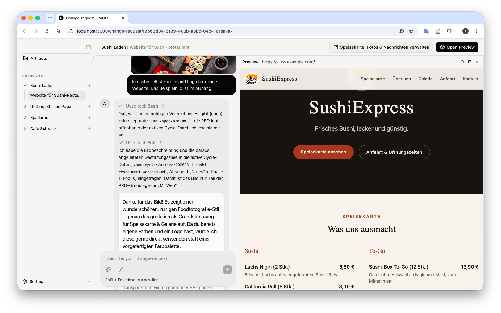

<p align="center">
  
</p>

<h1 align="center">pages-adu</h1>

<p align="center">
  The agentic-development unit (ADU) for PAGES (Prompt-based AI generation engine for sites) is a chat interface for creating websites by abstracting the source-code. A user describes a change request in plain language;
  the backend runs the <a href="https://claude.com/product/claude-code">Claude Code CLI</a> itself against a real
  checkout of the target website's repository to make the change — no manual coding required.
</p>

<p align="center">
  <a href="#how-it-works"><strong>How it works</strong></a> ·
  <a href="#tech-stack"><strong>Tech stack</strong></a> ·
  <a href="#running-locally"><strong>Running locally</strong></a> ·
  <a href="#project-structure"><strong>Project structure</strong></a> ·
  <a href="#development"><strong>Development</strong></a>
</p>
<br/>

## How it works

- **Artifacts** are the websites managed by this app — each one is a git checkout living under `workdir/<technicalName>`, seeded from a template repository (`TEMPLATE_REPO_URL`).
- **Change requests** belong to an artifact. Each change request is its own chat thread.
- Every chat turn in that thread invokes the Claude Code CLI (via [`ai-sdk-provider-claude-code`](https://www.npmjs.com/package/ai-sdk-provider-claude-code), not the plain Anthropic Messages API) with `cwd` set to that artifact's checkout, so Claude can read and edit the real project files directly and auto-accept its own edits.
- There is no authentication — this is a single-tenant tool; every change request belongs to one fixed anonymous user.

## Tech stack

- [Next.js](https://nextjs.org) App Router with Turbopack
- [AI SDK](https://ai-sdk.dev/docs/introduction) + [`ai-sdk-provider-claude-code`](https://www.npmjs.com/package/ai-sdk-provider-claude-code) to drive the Claude Code CLI as the chat model
- [`@assistant-ui/react`](https://www.assistant-ui.com) for the chat UI, with remote thread list + custom message-history persistence
- [MongoDB](https://www.mongodb.com) (via Mongoose) for artifacts, change requests, and message history
- [MinIO](https://min.io) (S3-compatible) for asset storage, plus a [Directus](https://directus.io) CMS instance backed by it
- [shadcn/ui](https://ui.shadcn.com), [Tailwind CSS](https://tailwindcss.com), [Radix UI](https://radix-ui.com)
- [Docker](https://docker.com), [Tailwind CSS](https://tailwindcss.com), [Radix UI](https://radix-ui.com)

## Running locally

You'll need Node.js, [pnpm](https://pnpm.io), and Docker (for the local backing services).

1. Copy `.env.example` to `.env` and fill in the values (see below). Use the `docker-compose.yml` in `./deployment-targets/docker`.
2. Start the backing services:

   ```bash
   docker compose up
   ```

   This provisions MongoDB, MinIO (+ bucket init), and a Directus CMS instance behind Traefik. If you only need chat + change requests, `docker compose up mongo minio minio-init` is enough.

3. Install dependencies and start the dev server:

   ```bash
   pnpm install
   pnpm dev
   ```

The app runs at [localhost:3000](http://localhost:3000).

### Environment variables

| Variable                  | Purpose                                                              |
| ------------------------- | -------------------------------------------------------------------- |
| `MONGODB_URI`             | MongoDB connection string                                            |
| `CLAUDE_CODE_OAUTH_TOKEN` | Claude Code auth token (`claude setup-token`)                        |
| `WORKDIR`                 | Host path containing the artifact checkouts Claude Code edits        |
| `TEMPLATE_REPO_URL`       | Git repository new artifacts are seeded from                         |
| `CLAUDE_MODEL`            | Claude model used for change-request chat turns                      |
| `SERVICE_PROXY_URL`       | URL of the service proxy used for sandboxed previews                 |
| `DOCS_UNIT_URL`           | URL of the docs MCP server exposed to Claude Code during chat        |
| `NEXT_PUBLIC_BASE_PATH`   | Path prefix for path-prefixed deployments (e.g. a `/demo` mount)     |
| `DIRECTUS_*`              | Directus CMS credentials/config (local dev only, see `.env.example`) |

See [`.env.example`](.env.example) for the full list and defaults.

## Project structure

```
app/(change-request)/   # Main app: artifact & change-request list/detail pages, chat API
app/(sidebar)/          # Sidebar data API
components/              # Chat UI (assistant-ui primitives), shared UI components
lib/db/                  # Mongoose models: Artifact, ChangeRequest, Message
lib/ai/                  # Model wiring (Claude Code provider, Anthropic Files API client)
skills/                  # Claude Code skills used by this repo's own tooling (e.g. eu-forge)
workdir/                 # Artifact checkouts that change requests are applied to
```

## Development

This repository is itself developed using the **EU-FORGE** methodology (see `skills/eu-forge`) — an Intent-Driven Development workflow with Focus/Orchestrate/Refine/Generate/Evaluate phases, cycle state tracked under `.adu/`.

```bash
pnpm lint             # ESLint
pnpm format           # Prettier — write
pnpm format:check     # Prettier — check only
```

There is no test suite configured in this repo currently.

See [`CLAUDE.md`](CLAUDE.md) for detailed architecture notes for AI-assisted development in this repo.

## Cite

This is a prototype created in the master's thesis of Alexander Rohrauer, BSc. BibTex citation:

```
@mastersthesis{Rohrauer_2026a,
	title        = {Entwicklung eines LLM-gestützten Low-Code-Systems zur Generierung dynamischer Webseiten},
	author       = {Rohrauer, Alexander},
	year         = 2026,
	type         = {Master's Thesis}
}
```
